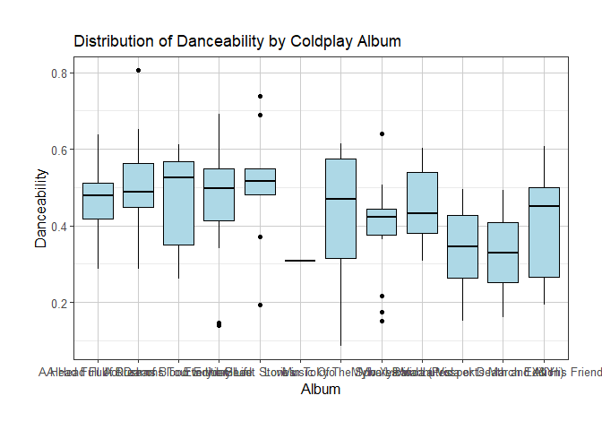

# Purpose

This document’s purpose is to show the combined working’s from all 5 of
my individual readme’s for each question.

``` r
rm(list = ls()) # Clean your environment:
gc() # garbage collection - It can be useful to call gc after a large object has been removed, as this may prompt R to return memory to the operating system.
```

    ##          used (Mb) gc trigger (Mb) max used (Mb)
    ## Ncells 456180 24.4     981250 52.5   644242 34.5
    ## Vcells 819743  6.3    8388608 64.0  1634844 12.5

``` r
library(tidyverse)
```

    ## ── Attaching packages ─────────────────────────────────────── tidyverse 1.3.2 ──
    ## ✔ ggplot2 3.4.2     ✔ purrr   1.0.1
    ## ✔ tibble  3.2.1     ✔ dplyr   1.1.2
    ## ✔ tidyr   1.3.0     ✔ stringr 1.5.0
    ## ✔ readr   2.1.4     ✔ forcats 0.5.2

    ## Warning: package 'ggplot2' was built under R version 4.2.3

    ## Warning: package 'tibble' was built under R version 4.2.3

    ## Warning: package 'dplyr' was built under R version 4.2.3

    ## ── Conflicts ────────────────────────────────────────── tidyverse_conflicts() ──
    ## ✖ dplyr::filter() masks stats::filter()
    ## ✖ dplyr::lag()    masks stats::lag()

``` r
list.files('code/', full.names = T, recursive = T) %>% .[grepl('.R', .)] %>% as.list() %>% walk(~source(.))
```

# Question 1 

For this question I am looking at how different continents were affected
by Covid-19.

# Analysis 

Ok so firstly I need to import the data.

``` r
library(csvread)
coviddf <- read.csv("C:\\Users\\Peter Meihuizen\\Desktop\\Masters\\1st Semester\\Data Science\\Take-home test\\Question_1\\data\\Covid\\owid-covid-data.csv")
source("Question_1/code/create_covid_plots.R")
source("Question_1/code/data_transformation.R")
source("Question_1/code/smoke_data_trans.R")
source("Question_1/code/resp_trans.R")
source("Question_1/code/merge_resp_hosp.R")
source("Question_1/code/plot_smoke.R")
source("Question_1/code/time_series.R")
source("Question_1/code/create_time_covid_plots.R")
```

I want to compare how Covid affected African countries relative to other
continents. In order to do this I’m going to compare various COVID-19
statistics over 6 month intervals for every continent. Therefore I will
divide the times period into 5 periods: 2020-01, 2020-07, 2021-01,
2021-07 and 2022-01. I will give the mean value for each of these
continents over each 6 month period.

In order to do this I need to build a function which calculates the mean
value for a particular country over this a particular 6 month period.

I want to look at the mean value for total_cases_by_million for each
country so I’ll use the function calculate the mean for each country
based on each period.

``` r
library(tidyverse)

coviddf <- data_transformation(coviddf)
```

Ok so this function is giving me errors and is not working so I’m going
to try simplify it to calculate the mean_total cases for each country in
that particular period, first I’m going to add a period column to the
main data frame indicating the 5 different periods.

Now I generate the bargraphs showings the growing rates of the average
cases, hospitalisations, deaths and vaccinations.

``` r
# Generate mean cases per million plots
covid_cases <- create_covid_plots(coviddf, "mean_cases", "Mean Cases Per Million", "continent", "Period", "period")
```

    ## Warning: `aes_string()` was deprecated in ggplot2 3.0.0.
    ## ℹ Please use tidy evaluation idioms with `aes()`.
    ## ℹ See also `vignette("ggplot2-in-packages")` for more information.
    ## This warning is displayed once every 8 hours.
    ## Call `lifecycle::last_lifecycle_warnings()` to see where this warning was
    ## generated.

``` r
covid_cases
```

    ## Warning: Removed 7085 rows containing non-finite values (`stat_summary()`).

<!-- -->

``` r
# Generate mean daily hospitilizations per million plots
covid_hosp <- create_covid_plots(coviddf, "mean_hosp", "Mean Daily Hospitilizations Per Million", "continent", "Period", "period")
covid_hosp
```

    ## Warning: Removed 148925 rows containing non-finite values (`stat_summary()`).

<!-- -->

``` r
# Generate mean deaths per million plots
covid_deaths <- create_covid_plots(coviddf, "mean_deaths", "Mean Deaths Per Million", "continent", "Period", "period")
covid_deaths
```

    ## Warning: Removed 18497 rows containing non-finite values (`stat_summary()`).

<!-- -->

``` r
# Generate mean vaccinations per million plots
covid_vacs <- create_covid_plots(coviddf, "mean_vacs", "Mean Vaccinations Per Million", "continent", "Period", "period")
covid_vacs
```

    ## Warning: Removed 60475 rows containing non-finite values (`stat_summary()`).

<!-- -->

Ok so as can be seen in the results Africa is the least affected by
Covid on all accounts. Of all the continents it has the lowest number of
cases, hospitalisations, deaths and vaccinations per million of every
continent. It appears the more developed continents, Europe and North
America are the most significantly affected.

For the next part of my analysis I want to look at the correlation
between smoking and hospitalisations to see if countries with an higher
rate of smoking are more likely to be hospitalised. I need to import the
death_by_cause data to look at smoking related deaths.

``` r
deathdf <- read.csv("C:\\Users\\Peter Meihuizen\\Desktop\\Masters\\1st Semester\\Data Science\\Take-home test\\Question_1\\data\\Covid\\Deaths_by_cause.csv")
```

Because Europe was most significantly affected by Covid I want to only
look at European countries to do my comparison, I therefore want to look
at those countries which had the greatest level of lower respiratory
infections as these can cause higher death rates amongst smokers as they
have weaker lungs. Therefore I need to look at the 5 European countries
with the greatest number of average daily hospitalisations and the 5
lowest. I will find the hospitialisations and populations of all
measured European countries.

``` r
Eur_hosp_smoke <- smoke_data_trans(coviddf)

Eur_hosp_smoke
```

    ## # A tibble: 30 × 3
    ##    location  mean_hosp mean_pop
    ##    <chr>         <dbl>    <dbl>
    ##  1 Bulgaria       469.  6896655
    ##  2 Serbia         419.  6871547
    ##  3 Lithuania      362.  2689862
    ##  4 Romania        326. 19127772
    ##  5 Hungary        290.  9634162
    ##  6 France         265. 67422000
    ##  7 Poland         255. 37797000
    ##  8 Latvia         231.  1866934
    ##  9 Croatia        228.  4081657
    ## 10 Czechia        220. 10724553
    ## # ℹ 20 more rows

Ok so based on this it shows that the highest daily hospitalisations for
Covid in Europe over the five periods were in Bulgaria, Serbia,
Lithuania, Romania and Hungary whilst the lowest recorded daily
hospitalisations were in Norway, Finland, Iceland, Denmark and the
Netherlands.

Now I need to look at each countries prevalence for smoking by averaging
their respiratory infection deaths form the Deaths_by_cause data set.

``` r
avg_resp_deaths <- resp_trans(deathdf)
```

Now I need to combine these two sets to compare respiratory deaths with
covid hospitalisation and create a respiratoty deaths per population
variable.

``` r
Eur_hosp_smoke <- merge_resp_hosp(Eur_hosp_smoke)
```

Now that I have the average number of Covid hospitalisations and the
number of lower respiratory infection deaths per million of the
population I can create a scatter polt to see if their was any
correlation.

``` r
scatter_resp <- plot_smoke(Eur_hosp_smoke)
scatter_resp
```

<!-- -->

``` r
resp_death_table <- Eur_hosp_smoke %>%
  select(location, mean_hosp, percent_resp_deaths) %>% 
    tibble()

resp_death_table
```

    ## # A tibble: 10 × 3
    ##    location    mean_hosp percent_resp_deaths
    ##    <chr>           <dbl>               <dbl>
    ##  1 Bulgaria        469.                 389.
    ##  2 Serbia          419.                 187.
    ##  3 Lithuania       362.                 200.
    ##  4 Romania         326.                 360.
    ##  5 Hungary         290.                 118.
    ##  6 Netherlands      60.8                368.
    ##  7 Denmark          60.8                367.
    ##  8 Iceland          48.5                250.
    ##  9 Finland          44.3                304.
    ## 10 Norway           28.6                418.

So as can be seen there is almost no correlation between the historical
respiratory deaths and daily Covid hospitalistions for countries in
Europe. This would suggest that countries with historically high levels
of smoking are unlikely to have more or less covid-related
hospitalisations.

For the final part of the question I’m going to look at monthly
hospitalisation numbers and ICU numbers for each continent and see if
the one led or lagged the other. Ok so first I’m going to group the data
by continent and by month.

``` r
library(lubridate)
```

    ## Loading required package: timechange

    ## 
    ## Attaching package: 'lubridate'

    ## The following objects are masked from 'package:base':
    ## 
    ##     date, intersect, setdiff, union

``` r
time_covid <- time_series(coviddf)
time_covid
```

    ## # A tibble: 209 × 4
    ##    continent year_month cont_hosp cont_ICU
    ##    <chr>     <chr>          <dbl>    <dbl>
    ##  1 ""        2020-01          NaN      NaN
    ##  2 ""        2020-02          NaN      NaN
    ##  3 ""        2020-03          NaN      NaN
    ##  4 ""        2020-04          NaN      NaN
    ##  5 ""        2020-05          NaN      NaN
    ##  6 ""        2020-06          NaN      NaN
    ##  7 ""        2020-07          NaN      NaN
    ##  8 ""        2020-08          NaN      NaN
    ##  9 ""        2020-09          NaN      NaN
    ## 10 ""        2020-10          NaN      NaN
    ## # ℹ 199 more rows

Now I want to plot the data to see if hospitalisations number lead or
lag ICU numbers.

``` r
# Generate plots for Europe
Eur_ICU <- create_time_covid_plots(time_covid, "Europe")
Eur_ICU
```

    ## Warning: Removed 1 row containing missing values (`geom_line()`).

<!-- -->

``` r
# Generate plots for Asia
Asia_ICU <- create_time_covid_plots(time_covid, "Asia")
Asia_ICU
```

    ## Warning: Removed 2 rows containing missing values (`geom_line()`).

    ## Warning: Removed 2 rows containing missing values (`geom_line()`).

<!-- -->

``` r
# Generate plots for North America
NA_ICU <- create_time_covid_plots(time_covid, "North America")
NA_ICU
```

    ## Warning: Removed 2 rows containing missing values (`geom_line()`).
    ## Removed 2 rows containing missing values (`geom_line()`).

<!-- -->

Therefore it appears that the level of hospitalizations, which is being
used as a proxy for hospital capacity, doesn;t lead or lag ICU
admissions, but rather coincides with them for Europe, Asia and North
America when looking at the monthly admissions.

------------------------------------------------------------------------

# Question 2 

For this question my goal is to prove to my friend that the weather in
the UK is terrible.

# Analysis 

To conduct my analysis I must first import my data files.

``` r
london <- read.csv("C:\\Users\\Peter Meihuizen\\Desktop\\Masters\\1st Semester\\Data Science\\Take-home test\\Question_2\\data\\London\\london_weather.csv")
source("Question_2/code/plot_midlands.R")
source("Question_2/code/midlands_transform.R")
source("Question_2/code/london_weather.R")
source("Question_2/code/plot_london.R")
source("Question_2/code/transform_data.R")
```

Ok so first I want to plot a temperature graph showing the mean
temperature for each month for both london and the midlands datasets. I
will make a function which does this and therefore I can replicate the
process with other weather elements. I’m interested in convincing you
not to move there, therefore I am only concerned with assessing the
weather since the turn of the 21st century.

``` r
library(lubridate)

london <- transform_data(london)
```

Plotting a bargraph of the average temperature, sunshine, rain and cloud
cover in London per month.

``` r
# Generate Average Monthly Temperature plot for London
temp_lon <- london_weather(london, quote(avg_temp_month), "Average Temperature",
                            "Average Monthly Temperature for London", "pink")
temp_lon
```

<!-- -->

``` r
# Generate Average Monthly Precipitation plot for London
prec_lon <- london_weather(london, quote(avg_prec_month), "Average Precipitation",
                            "Average Monthly Precipitation for London", "blue")
prec_lon
```

<!-- -->

``` r
# Generate Average Monthly Sunshine plot for London
sun_lon <- london_weather(london, quote(avg_sun_month), "Average Sunshine",
                            "Average Monthly Sunshine for London", "yellow")
sun_lon
```

<!-- -->

``` r
# Generate Average Monthly Cloud Cover plot for London
clo_lon <- london_weather(london, quote(avg_cloud_month), "Average Cloud Cover",
                            "Average Monthly Cloud Cover for London", "grey")
clo_lon
```

<!-- -->

This measures the average for each month over a 20 year period and as
can be seen the weather in London is pretty miserable. In their best
months they only get 6 hours of sun on average a day, even though it is
daytime for over 16 hours in those months. They get constant rain and
cloud cover throughout the year and their average temperature doesn’t
even get above 20 in their best months. But you want to live in the mid
parts of england so lets see how these stats look compared to London.

Now we must import the data for the midlands in the UK and look at the
monthly weather here.

``` r
midlands <- read.csv("C:\\Users\\Peter Meihuizen\\Desktop\\Masters\\1st Semester\\Data Science\\Take-home test\\Question_2\\data\\London\\UKMonthly_Detailed.csv")
```

Now we transfrom the data.

``` r
library(dplyr)
library(lubridate)

midlands <- midlands_transform(midlands)
```

Ok so the only values we have are for temperature and precipitation.
Once again we’re looking at the average temperature for each month over
a 20 year period. However for precipitation the data shows the amount of
rain on the most rainy day in the month. These values are then average
over 20 years.

``` r
temp_mid <- ggplot(midlands, aes(x = month, y = avg_temp_month)) +
  stat_summary(geom = "bar", fill = "pink", fun = "mean") +
  labs(x = "Month", y = "Average Temperature", title = "Average Monthly Temperature for Midlands") +
  theme_bw()

temp_mid
```

<!-- -->

``` r
prec_mid <- ggplot(midlands, aes(x = month, y = avg_prec_month)) +
  stat_summary(geom = "bar", fill = "blue", fun = "mean") +
  labs(x = "Month", y = "Average Precipitation", title = "Average Monthly Precipitation for Midlands") +
  theme_bw()

prec_mid
```

<!-- -->

As you can see it is even colder in the midlands where you plan to go,
every month is nearly 5 degrees colder than in London. Also the most
rainy days of the year happen in Summer in the midlands based on these
graphs. Even their warmest months have lots of rain. Therefore it is
pretty evident that the weather in the UK is, as expected, pretty
terrible and you should definitely rather stay in Cape Town.

------------------------------------------------------------------------

# Question 3 

This question shows the popularity of different songs for Metallica and
Coldplay. I will try to analyse these different songs to see what makes
a song popular.

# Analysis 

I first need to import the data for both Coldplay and Metallica’s songs.

``` r
Coldplay <- read.csv("C:\\Users\\Peter Meihuizen\\Desktop\\Masters\\1st Semester\\Data Science\\Take-home test\\Question_3\\data\\Coldplay_vs_Metallica\\Coldplay.csv")

Metallica <- read.csv("C:\\Users\\Peter Meihuizen\\Desktop\\Masters\\1st Semester\\Data Science\\Take-home test\\Question_3\\data\\Coldplay_vs_Metallica\\metallica.csv")
source("Question_3/code/create_scatterplot.R")
source("Question_3/code/boxplot_create.R")
```

So I want to look at what makes songs popular, so I’m going to do some
scatter plots to plot the songs various aspects with their popularity to
see how they compare. To do this I’m going to build a function which
makes a scatterplot.

Plotting the scatterplot shows as follows:

``` r
Coldplay %>% 
    create_scatterplot(valence, popularity, title = "Coldplay Songs Popularity and Positivity")
```

    ## `geom_smooth()` using formula = 'y ~ x'

<!-- -->

It can be seen that Coldplay’s music mostly has a lower valence, meaning
it resembles mostly negative emotions, and it appears that there is a
slight negative correlation between vlence and popualrity, suggesting
more positive music does slightly worse than more negative music.

Everyone likes to dance right? So what effect does the danceability have
on the popularity of their songs?

``` r
Coldplay %>% 
    create_scatterplot(danceability, popularity, title = "Coldplay Songs Popularity and Tempo")
```

    ## `geom_smooth()` using formula = 'y ~ x'

<!-- -->

Again it appears that danceability has a positive effect on the
popularity of Coldplay’s songs.

Ok what about Metallica?

``` r
Metallica %>% 
    create_scatterplot(valence, popularity, title = "Metallica Songs Popularity and Positivity")
```

    ## `geom_smooth()` using formula = 'y ~ x'

<!-- -->

There seems to be minimal correlation between valence and popularity for
Metallica’s songs. It seems as though their songs are more concentrated
around a low valence, suggesting they express negative emotions. However
their more positive songs are slgihtly more popular as is suggested by
the very gradual slope of the correlation line.

``` r
Metallica %>% 
    create_scatterplot(danceability, popularity, title = "Metallica Songs Popularity and Tempo")
```

    ## `geom_smooth()` using formula = 'y ~ x'

<!-- -->

Again, the same as was seen with Coldplay, danceability increases the
popularity of Metallica’s songs, despite the majority of their songs
being lower on the danceability scale.

Ok so it seems as though danceability makes a particular bands songs
more popular. So let’s see how the popularity and danceablility was
distributed across their various albums and see whether these are
linked. In order to do this lets make a function that looks at the
distribution of the danceability of the different albums of Coldplay and
Metallica.

I’m just going to rename the album_name column in the Coldplay data
frame so that it is the same as in the Metallica data set. I am also
going to get rid of the live albums and songs.

``` r
Coldplay <- Coldplay %>%
    rename(album = album_name) %>%
    filter(!grepl("live|Live", album)) %>% 
    filter(!grepl("live|Live", name))
```

Now ploting the boxplots, first by popularity:

``` r
Coldplay_pop <- Coldplay %>% 
    boxplot_create(popularity, y_lab = "Popularity", title = "Distribution of Popularity by Coldplay Album")
```

    ## Warning: The `size` argument of `element_line()` is deprecated as of ggplot2 3.4.0.
    ## ℹ Please use the `linewidth` argument instead.
    ## This warning is displayed once every 8 hours.
    ## Call `lifecycle::last_lifecycle_warnings()` to see where this warning was
    ## generated.

``` r
Coldplay_pop
```

<!-- -->

So as can be seen Coldplay’s albums vary quite a lot in terms of there
popularity, some were significantly more popular than others. What abou
the daceability of their albums?

``` r
Coldplay_dance <- Coldplay %>% 
    boxplot_create(danceability, y_lab = "Danceability", title = "Distribution of Danceability by Coldplay Album")

Coldplay_dance
```

<!-- -->

It appears as though the distribution of danceable songs on Coldplay’s
albums have been pretty similar across albums.

How about Metallica now. First I need to remove the live songs and
albums.

``` r
Metallica <- Metallica %>%
    filter(!grepl("live|Live", album)) %>% 
    filter(!grepl("live|Live", name))
```

Now to look at the popularity and danceability of the albums. First
popularity.

``` r
Metallica %>% 
    boxplot_create(popularity, y_lab = "Popularity", title = "Distribution of Popularity by Metallica Album")
```

<!-- -->

Ok similar to Coldplay there are some differences in popularity between
Matallica’s albums. Now let’s look at their danceability.

``` r
Metallica %>% 
    boxplot_create(danceability, y_lab = "Danceability", title = "Distribution of Danceability by Metallica Album")
```

<!-- -->

As can be seen there’s more variation within albums around the
dancability of Metallica’s songs, however this variation is seen in most
of there albums suggesting they do not really change their methods
between albums.

------------------------------------------------------------------------

# Question 4 

Ok so lets see what is popular on netflix.

# Analysis 

Let’s first import the data

``` r
netflix <- read.csv("C:\\Users\\Peter Meihuizen\\Desktop\\Masters\\1st Semester\\Data Science\\Take-home test\\Question_4\\data\\netflix\\titles.csv")
source("Question_4/code/top10.R")
source("Question_4/code/top200.R")
```

We now have a netflix data set showing the information on shows and
movies. This also shows the rating an votes made on IMDB, a well
respected website which gives reliable ratings while accurately
reflecting public opinion towards shows and movies. Therefore I will use
IMDB scores as a metric for quality of a show or movie, and I will use
the number of IMDB votes as a metric for the number of people who
watched the show/movie. To see if the more frequently watched movies are
also highly rated I will plot the 10 most voted movies and there IMDB
scores.

``` r
top_10_imdb_votes <- netflix %>% 
  top10(imdb_votes, title, type, release_year, imdb_score, production_countries, x = 10)

top_10_imdb_votes
```

    ## # A tibble: 10 × 6
    ##    title           imdb_votes type  release_year imdb_score production_countries
    ##    <chr>                <dbl> <chr>        <int>      <dbl> <chr>               
    ##  1 Inception          2268288 MOVIE         2010        8.8 ['GB', 'US']        
    ##  2 Forrest Gump       1994599 MOVIE         1994        8.8 ['US']              
    ##  3 Breaking Bad       1727694 SHOW          2008        9.5 ['US']              
    ##  4 Django Unchain…    1472668 MOVIE         2012        8.4 ['US']              
    ##  5 Saving Private…    1346020 MOVIE         1998        8.6 ['US']              
    ##  6 Stranger Things     989090 SHOW          2016        8.7 ['US']              
    ##  7 The Walking De…     945125 SHOW          2010        8.2 ['US']              
    ##  8 Taxi Driver         795222 MOVIE         1976        8.3 ['US']              
    ##  9 The Imitation …     748654 MOVIE         2014        8   ['US', 'GB']        
    ## 10 Full Metal Jac…     723306 MOVIE         1987        8.3 ['GB', 'US']

As can be seen the most voted movies and shows on IMDB all also have
very high ratings. They are also very well_known movies and tv shows.
This shows that well-known and highly rated movies/shows are the most
popular amongst viewers. It can also be seen that all the top picks are
made by US or GB production companies.

In order to be a successful streaming company, we need people to watch
our content therefore I will use imdb_votes as the metric for viewership
and see what factors attracts people to watch particular content. Using
the netflix data set, I am going to look at the top 200 shows most
viewed shows and movies and see the breakdown of these shows and movies
by genre.

Ok so I want to build a function which shows the distribution of the top
200 shows on netflix. Ok so I’m having issues with my function so I’m
just going to create two data sets each with only movies and only shows
in case I want to see the most popular movie genres also.

``` r
movies <- filter(netflix, grepl("MOVIE", netflix$type)) 
shows <- filter(netflix, grepl("SHOW", netflix$type))
```

Ok now that I have seperated the data sets, we can work out the most
popular 200 shows to see what genres are popular.

``` r
top200_shows <- top200(shows, "Genres of Top 200 Shows")
top200_shows
```

<!-- -->

``` r
top200_movies <- top200(movies, "Genres of Top 200 Movies")
top200_movies
```

<!-- -->

Ok so as can be seen by both bargraphs, the top shpws and movies which
are watched are drama and comedy. Drama is the most voted by quite a
long way for both, but comedy also is significantly more popular than
the remaining genres. All of the remaining genres are pretty similar in
popularity. This shows that if you want to make a successful streaming
platform, your content should be predominantly made up of drama shows
and movies, as well as comedies.

------------------------------------------------------------------------

# Question 5 

For this question we will be looking at the database of app downloads
from Google to see what encourages people to download a particular app.

# Analysis 

Firstly I need to import the data.

``` r
Google <- read.csv("C:\\Users\\Peter Meihuizen\\Desktop\\Masters\\1st Semester\\Data Science\\Take-home test\\Question_5\\data\\googleplay\\googleplaystore.csv")
source("Question_5/code/scatter.R")
source("Question_5/code/Review_table.R")
```

Ok so based on the data I want to see what are the most downloaded types
of apps, therefore I will look at the number of installations per
application type. First I need to change this line to be numeric values.

``` r
Google$Installs <- as.numeric(gsub("[+,]", "", Google$Installs))
```

Ok so now I want to see which app categories are the most used. In order
to do that I am going to do a scatter plot which shows the average
number of reviews of each app category, as well as the average number of
downloads received by each category.

``` r
Review_Install_scatter <- scatterplot(Google)
Review_Install_scatter
```

<!-- -->

Ok so we can see that communication apps are by far the most installed
type of app on average, having the highest average number of reviews and
installations. In terms of installations it is followed by social apps
and then gaming apps. The second most reviewed category seems to be
video_players.

So we know what is the most used types of apps and most reviewed.
However an important factor when understanding the reviews of a
particular is app is whether or not they are positive. Apps with more
positive reviews are likely to be used more frequently, so using the
user review data set, we can compare the percentage of positive,
negative and neutral reviews for each app category.

``` r
Review <- read.csv("C:\\Users\\Peter Meihuizen\\Desktop\\Masters\\1st Semester\\Data Science\\Take-home test\\Question_5\\data\\googleplay\\googleplaystore_user_reviews.csv")
```

Ok now we must merge the category column to be assigned with
therespective app in the Review data set.

``` r
category <- Google %>% select(App, Category)

merged_data <- Review %>%
  left_join(category, by = "App")
```

    ## Warning in left_join(., category, by = "App"): Detected an unexpected many-to-many relationship between `x` and `y`.
    ## ℹ Row 1 of `x` matches multiple rows in `y`.
    ## ℹ Row 1178 of `y` matches multiple rows in `x`.
    ## ℹ If a many-to-many relationship is expected, set `relationship =
    ##   "many-to-many"` to silence this warning.

Ok so now using the merged data we can work out the percentage of each
type of review in each category.

``` r
Pos_neg_reviews <- Review_table(merged_data)

Pos_neg_reviews
```

    ## # A tibble: 10 × 4
    ##    Category           pos_percent neg_percent neu_percent
    ##    <chr>                    <dbl>       <dbl>       <dbl>
    ##  1 COMMUNICATION             62.7        20.6       16.7 
    ##  2 ENTERTAINMENT             58.3        25.5       16.2 
    ##  3 GAME                      58.1        37.5        4.37
    ##  4 NEWS_AND_MAGAZINES        57.6        29.3       13.1 
    ##  5 PHOTOGRAPHY               65.7        20.4       13.9 
    ##  6 PRODUCTIVITY              68.8        18.7       12.4 
    ##  7 SOCIAL                    54.1        26.2       19.7 
    ##  8 TOOLS                     60.4        17.6       22.0 
    ##  9 TRAVEL_AND_LOCAL          60.9        21.3       17.8 
    ## 10 VIDEO_PLAYERS             57.4        25.1       17.5

So as can be seen most app categories have round 60% positive reviews,
25% negative reviews and 15% neutral reviews. Communication apps have a
good positive percentage relative to other app types. They have the best
percentage results amongst their closest competitors in terms of
installations, with 63% positive reviews and 21% negative reviews.
Comparatively, social apps having 54% positive reviews and 26% negative
reviews, whilst gaming apps have 58% positive reviews and 37% negative
reviews. Based on these results it seems evident that the best type of
app to produce would be a Communication app.
